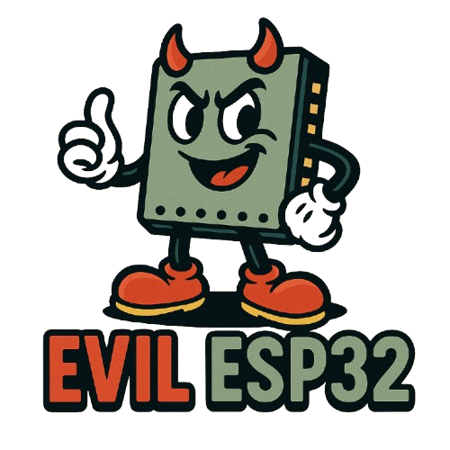

<div align="center">
  
  <h1><strong>Evil ESP32</strong></h1>
  <p>Captive Portal Generator</p>
</div>
EvilESP32 is an ESP32-based toolkit designed for building and deploying customizable captive portals for educational, research, and demonstration purposes.

## ✨ Features

* **Pre-Built Captive Portals**
  Deploy spoofed login pages (e.g., Google, Microsoft, JetBlue, Spirit, Verizon, Southwest, Cox, T-Mobile, American Airlines).

* **Custom Portal Upload**
  Upload your own HTML/CSS/JS designs directly via the web interface.

* **Credential Logging**
  Captures submitted usernames/emails and passwords.

* **Web-Based Admin Dashboard**
  Control portal selection, monitor credentials, scan nearby networks, and update SoftAP settings via an intuitive web UI.

* **Wi-Fi Scanning**
  Scan and view nearby access points from the dashboard.

## 🛠️ Tech Stack

* **Hardware:** ESP32 Dev Boards (e.g., NodeMCU ESP32, ESP32-DevKitC)
* **Firmware Development:** Arduino IDE
* **Core Components:**

  * `WebServer`, `DNSServer`, `SPIFFS`, `Preferences` (all part of the ESP32 core)
  * HTML, CSS, JavaScript for front-end design and dashboard

## 🚀 Getting Started

### ✅ Prerequisites

* **Hardware:** ESP32 development board
* **Software:** Arduino IDE with ESP32 support

### 📦 Install ESP32 Board Support

1. Open Arduino IDE
2. Go to: `File > Preferences`
3. In *Additional Boards Manager URLs*, add:

   ```
   https://raw.githubusercontent.com/espressif/arduino-esp32/gh-pages/package_esp32_index.json
   ```
4. Go to: `Tools > Board > Boards Manager`, search for **ESP32**, and install it.

### 📚 Required Libraries

These are included with the ESP32 core:

* `WebServer`
* `DNSServer`
* `SPIFFS`
* `Preferences`

Ensure headers like `WiFi.h`, `esp_wifi.h`, `esp_mac.h`, and `esp_event.h` are available.

### 3. Upload Firmware

1. Select your board via `Tools > Board > ESP32 Arduino > [Your Board]`.
2. Select the correct port (`Tools > Port`).
3. Click **Upload** to flash the ESP32.

## 🧪 Usage

1. **Power on the ESP32**
2. **Connect to AP:** Look for `EvilESP32AP` in your Wi-Fi list.
3. **Open Dashboard:** Navigate to [http://192.168.4.1/dashboard](http://192.168.4.1/dashboard).
4. **Activate a Portal:** Toggle any available template from the list (e.g., Google, Microsoft).
5. **Upload a Custom Portal:**

   * Paste your HTML into the provided textarea under "Access Points".
   * Click **Upload Portal** to activate it.

### ⚙️ Advanced Options

* **SoftAP Settings:**
  Customize SSID and MAC under the *Access Point* section.

* **Nearby Wi-Fi Scanning:**
  Use the *Scan APs* button to list all nearby Wi-Fi networks.

* **Credential Monitoring:**
  View harvested credentials in real time in the *Credentials* section.

## 💾 Captured Credentials

* Stored in `/pass.txt` in the ESP32’s SPIFFS & Uploaded to the web interface.

## 🛡️ Security & Ethics

> This tool is intended **only for legal, authorized use** in research, educational environments, or penetration testing engagements with **explicit permission**.

* **Unauthorized use is illegal.**
* Always follow ethical guidelines and respect privacy.

## Screenshot


## 🤝 Contributing
* Help improve templates, features, or dashboard functionality.

## ⚠️ Disclaimer

> **For educational and ethical security research only.**
>
> The developer assumes **no liability** for any misuse. Deploying this tool on networks without proper authorization may be illegal. Always get **explicit permission** before use.
